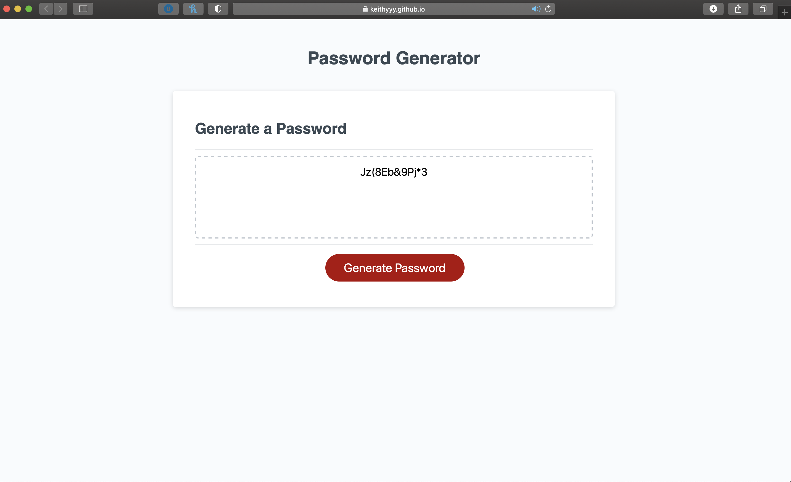

# PasswordGenerator
Using Javascript to create a functioning Password Generator

## Exercising Javascript

For this assignment, I am supposed to bring some action to this Password Generator site. 

When a user clicks the **Generate Password** button, a series of questions will appear to get a better glimpse of what they are looking their password to have.

How many characters? Uppercase, lowercase, symbols, numbers?

The generator is able to fulfill the requests made and generate a password accordingly!

The results will show up in the text that originally wrote 'Your Secure Password'.

**You can find a link to here!** - https://keithyyy.github.io/PasswordGenerator/

**Here's a screenshot of how it having generated a 12-character password with all possible criteria asked for:**

